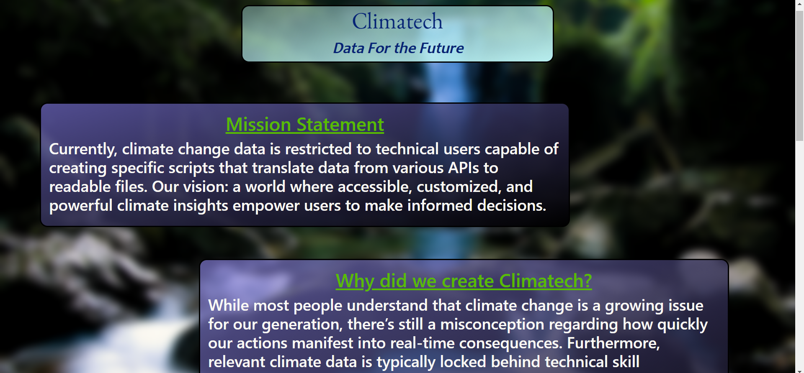
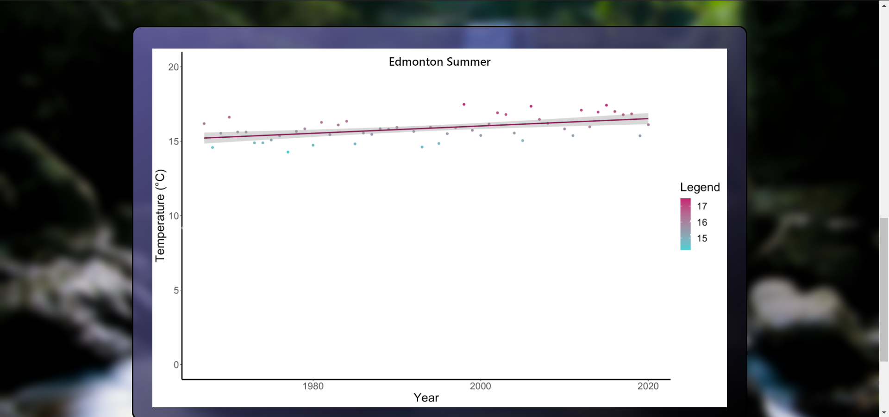
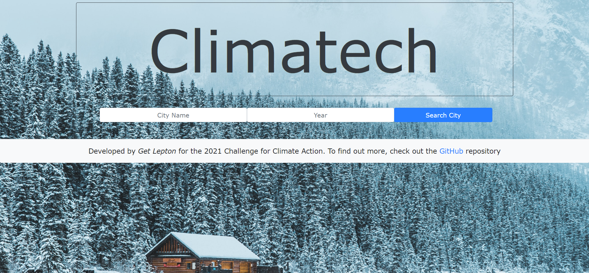
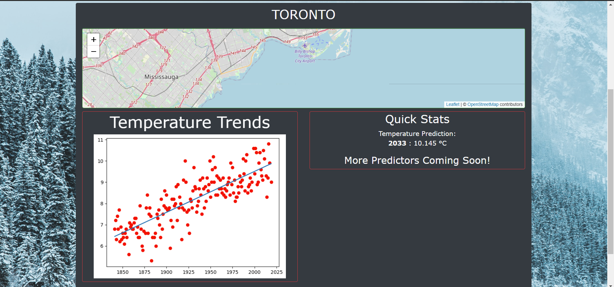

# DICHackathon2021 - Climatech by 'Get Lepton'

- Home Page

- Major Cities - Graphs

- Visualizations Page  

- Visualizations Search - Toronto  

- A Flask App that runs a linear regression modeller for the specific city searched by the user, among other features, to
  depict the reality of climate change within Canada, and to promote Climate Action on a grassroots level
- [Visit Climatech here!](https://climatechdatathon.herokuapp.com/)

## Motivation
- A project created for the 2021 Climate Datathon by 'Get Lepton' consisting of [Ali Raza Zaidi](https://github.com/AliRZ-02),
  [Brian Widjaja](https://github.com/brianwidjaja), [Kevin Hu](https://github.com/kevinhu12), [Ahmad Islah](https://github.com/ahmadislah),
  and [Jenny Wu](https://github.com/JianiWu)
- We created this website to help Canadians realize the impact of our actions on our own communities and to help foster change.
- Additionally, the data available to Canadians right now is limited to technically sound users through the likes of an API or large CSV files,
	while other sources of data are convoluted with a lack of regard for the knowledge level of the average user
- This is why we feel the ramifications of climate change and of our own actions are difficult to visualize right now, which we hope to change
- We hope to give Canadians the latest available data, tailored for their own communities, making the data easier to visualize and understand, while removing the need for scripting and complicated data retrieval methods in accessing said data for the average Canadian
- We have also included a linear regression modeller to predict the temperature of the city selected by the user in te year they have selected it for, to give users the full picture of the impact of our actions

### Getting Started
- Visit the website [Here](https://climatechdatathon.herokuapp.com/).
- Since We're using a Free Heroku account, sometimes the app goes in hibernation and takes some 
time to open back up. Do not fret - Just let it take its time!
- When running a program of this sort on your own machine, you will need to have several python files installed, preferably
within a virtual environment and the required files can be seen in the `[Requirements File](requirements.txt)`
- Knowledge of Front-End development and Back-End development(through Flask) is required. Additionally, 
Knowledge of Python 3 is required
- For the visualizations page, running the modeller and retrieving data from the Canadian Government's Weather API may take some time, so don't worry!

#### Installation
- We edited the app in both VScode and the Pycharm IDE, testing the program through our local machines
- To run the flask app, create a file named `app.py` and import the modules present in this [file](app.py)
- Add the following code under the file imports:
\
`app = Flask(__name__)
app.config['SQLALCHEMY_DATABASE_URI']='sqlite:///requests.db'
db = SQLAlchemy(app)`

- Make sure to add the following code at the bottom of the file:
\
`if __name__ == '__main__':
	app.run(debug=False)`
- Create a database in the working directory by running the following code in a terminal:
\
`python
from app import db
db.create_all()`

- To delete the database, run the following in a terminal:
\
`python
from app import db
db.delete_all()`

- This will ensure that the file can run. Add the following code to the app.py file underneath 
the app configuration and database setup:
\
`@app.route('/', methods=['POST', 'GET'])
def index():
	if request.method == 'POST':
		return redirect('/')
	else:
		return render_template('index.html')`
  
- For a much more in-depth explanation, visit this video by [freeCodeCamp.org](https://www.youtube.com/watch?v=Z1RJmh_OqeA)
- For the data collection, we used data available from [ClimateData.ca](https://climatedata.ca/), who led us to the Canadian Government's Weather API, after emailing them regarding their datasets.
- The models were run through the `scikit-learn` library in Python for each city, as they were searched for
- The models used were Linear Regression Models,
- The [AHCCD Data Processor](static/getData.py) and [Climate Stations Data Processor](static/climateData.py) files processed data for the respective stations that were called
- The [Flask App](app.py) script had several methods added to it along with the required route decorators to ensure backend functionality. 
- The necessary HTML and CSS files (Although, Bootstrap 4 was used extensively in much of the program) were added, alongside some in-line JS to get the front-end working
	- Jinja 2 scripts were added inline as well to process the information received from the database and to ensure proper functionality of the code
- The app was then deployed to Heroku via GitHub
- All the station names were downloaded via JSON files and turned into CSV files using the [getStations Script](static/getStations.py)
- The map's functionality was derived through code written on creating maps through [Leaflet](https://maptimeboston.github.io/leaflet-intro/)

#### Test Run
- To Test the file, visit the [website](https://capredictor.herokuapp.com) or run it locally by running
the following code in your terminal:
\
`python app.py`

#### Deployment
- The program has been deployed on Heroku

### Authors
- The website was developed by the `Get Lepton` team for the 2021 Climate4ClimateAction Datathon 

### License
- This Software is licensed through the GNU GPL 3.0 License

### Development
- This project is in its release phase now, although minor improvements are continually made